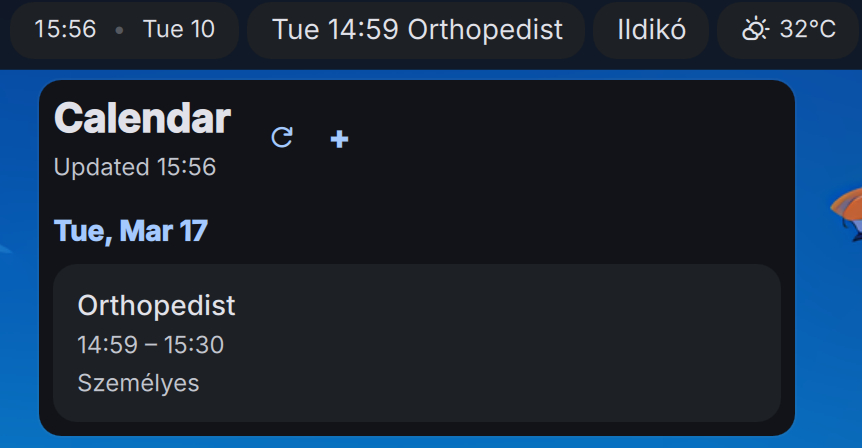

# qCal Calendar — DankMaterialShell Plugin

A DankBar widget that shows upcoming CalDAV calendar events with a full popout panel for viewing, creating, editing, and deleting events.




## Features

- Works with iCloud, Google, Nextcloud, and any CalDAV server
- Auto-discovery of all calendars under a CalDAV account
- Read-only ICS feed support (private "secret address in iCal format" URLs) — useful for Google/Outlook calendars that no longer allow basic-auth CalDAV
- GNOME Keyring integration (falls back to plaintext config if unavailable)
- Create, edit, and delete events directly from the popout
- Desktop notifications before upcoming events
- Per-calendar name display and event location display
- Configurable look-ahead window and refresh interval

## Bar Display

- **Horizontal pill**: shows the next upcoming event with time and title (e.g. `14:00 Meeting`)
- **Vertical pill**: shows the total event count with a "cal" label

## Popout Panel

- Grouped event list by day with time ranges
- Color-coded all-day and timed events
- Click an event to edit title, time, and location
- Add new events with calendar selection, date/time pickers, and optional location
- Last updated timestamp

## Settings

| Setting | Description | Default |
|---|---|---|
| CalDAV URL | Base URL of your CalDAV server (calendars are auto-discovered) | — |
| Username | CalDAV account username | — |
| Password | App-specific password (stored in GNOME Keyring when available) | — |
| Look-ahead (days) | How many days into the future to show events | 7 |
| Refresh interval (minutes) | How often to fetch events from the server | 5 |
| Show event location | Display location for events that have one | On |
| Show calendar name | Display which calendar each event belongs to | Off |
| Desktop notifications | Send a notification before upcoming events | On |
| Notify before (minutes) | How far in advance to notify | 15 |

Multiple CalDAV providers can be configured by editing `~/.config/qcal/config.json` directly.

## ICS feeds (read-only)

Some providers (notably Google since its March 2025 basic-auth CalDAV shutdown) no longer work with username/password CalDAV. For those, use the calendar's **private ICS URL** ("secret address in iCal format"):

- **Google Calendar** → Settings → *Settings for my calendars* → pick the calendar → *Integrate calendar* → copy **Secret address in iCal format**.
- **Outlook/Office 365** → calendar sharing → *Publish a calendar* → copy the **ICS** link.

Add it with the wrapper:

```bash
# from the plugin directory (or the deployed ~/.config/DankMaterialShell/plugins/qcalCalendar)
python3 qcal-wrapper.py add-ics "https://calendar.google.com/calendar/ical/.../basic.ics" --name "Work"
python3 qcal-wrapper.py list-ics              # show configured feeds
python3 qcal-wrapper.py remove-ics 0          # remove by index (or pass the URL)
```

Feeds are stored under an `IcsCalendars` array in `~/.config/qcal/config.json` and appear in the popout as read-only calendars (no add/edit/delete). Recurring events are expanded locally — including weekly `BYDAY` rules, `EXDATE` exclusions, and per-instance `RECURRENCE-ID` overrides — and all times are converted to your configured `Timezone`.

> The URL is a secret bearer token: anyone with it can read your calendar. Keep `config.json` private; regenerate ("reset") the link from the provider if it leaks.

## Dependencies

- `python3`
- `go` (build-time only, for compiling qcal)
- `secret-tool` (optional, for GNOME Keyring password storage)

## Installation

```bash
git clone --recurse-submodules https://github.com/szabolcsf/dms-qcal-calendar.git
cd dms-qcal-calendar
./setup.sh  # builds the qcal binary
cp -r . ~/.config/DankMaterialShell/plugins/qcalCalendar
```

Then enable the plugin in DMS Settings → Plugins, and add it to your DankBar. Configure your CalDAV account in the plugin settings.

## Compositors

Tested on Niri. Should work on any compositor supported by DankMaterialShell.

## License

MIT
